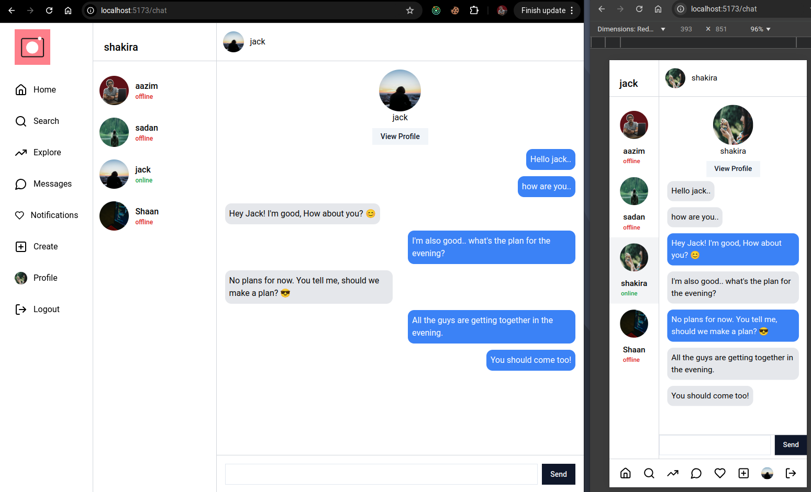
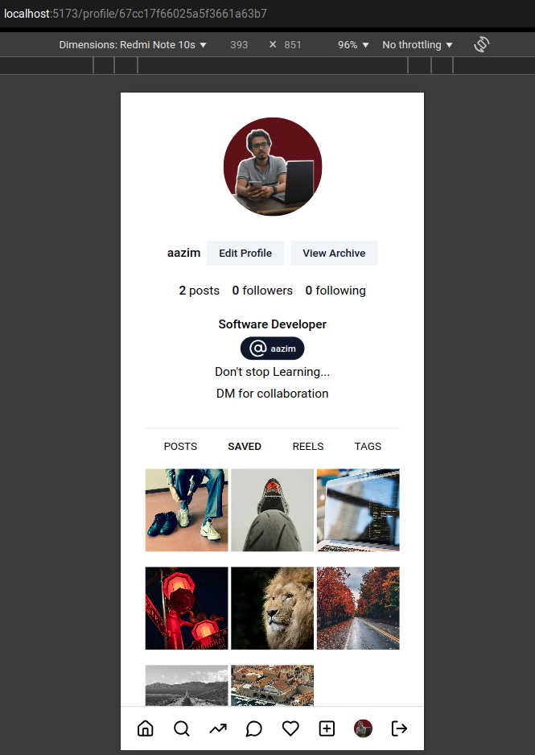
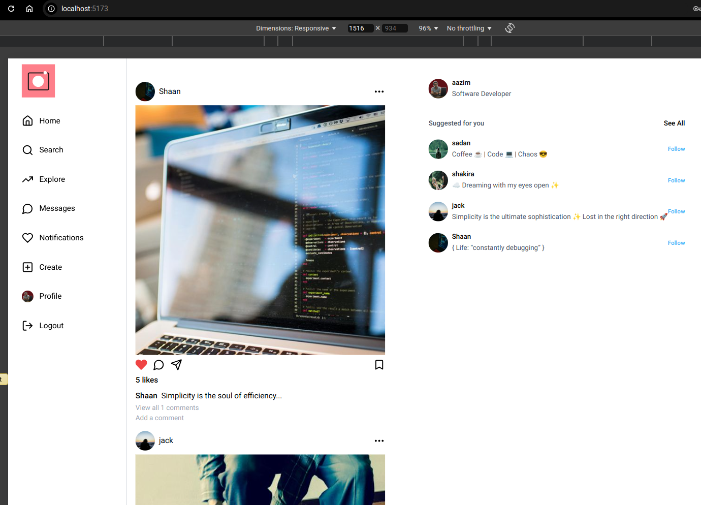
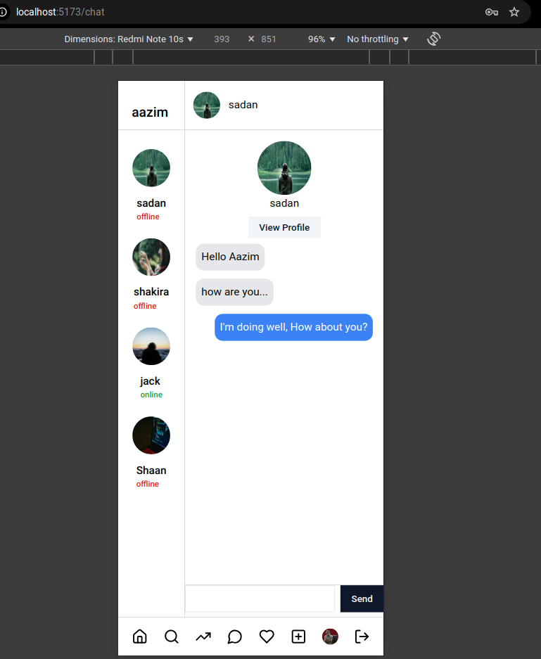

# PicVerse - A Fullstack Social Media & Chat App

This my repository for a picVerse developed using the MERN stack.
 
- <a target="_blank" href="https://picverse.onrender.com">App Link 🔗</a>

# Chat Page App
- Added the real-time chat feature.  
- Implemented the feature to show notifications when a message is sent.
</img>

# User Profile
- Created posts and saved posts are displayed along with profile details.
</img>

# Feed Page
- All posts are displayed.
- Users will have the functionality to comment, like and saved posts.
- The owner od the post will be able to delete the post.

</img>

# Phone View of Chat Page

</img>